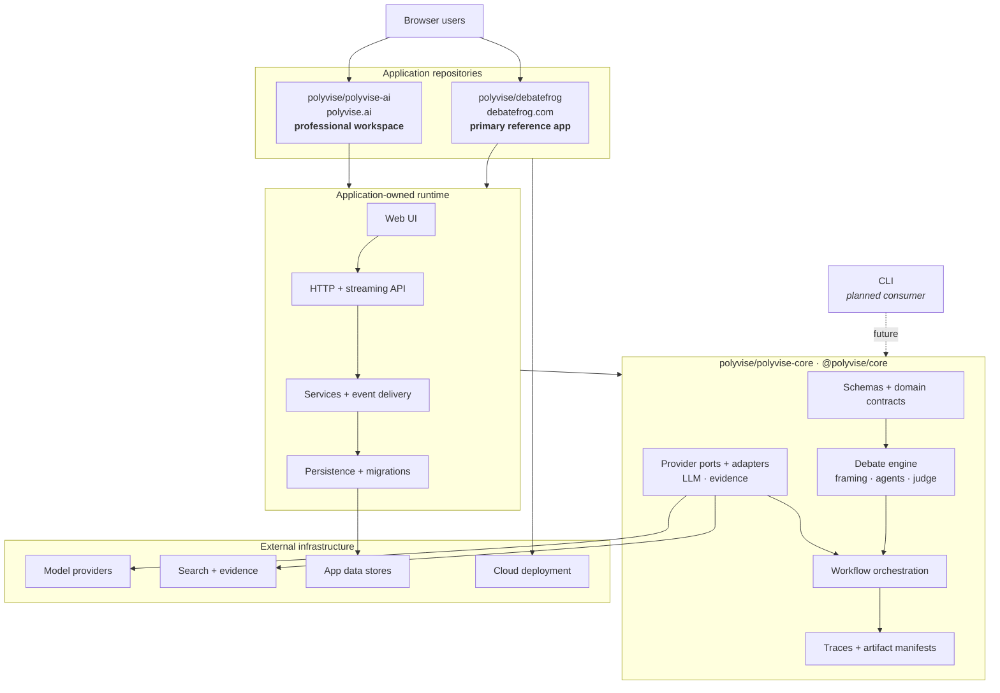

# Polyvise

Polyvise is a framework-neutral TypeScript library for structured, cited, multi-agent debates. It turns a free-text subject into a neutral resolution, assembles opposing agents and a neutral judge, runs a traceable debate workflow, and returns a decision brief with claims, sources, transcript, scorecard, and summary.

This repository contains the core library only. Product websites, persistence, API routes, deployment configuration, and brand-specific behavior live in separate repositories:

- [`polyvise/polyvise-ai`](https://github.com/polyvise/polyvise-ai) — `polyvise.ai`
- [`polyvise/debatefrog`](https://github.com/polyvise/debatefrog) — `debatefrog.com` is a cute reference implementation

## Install

```bash
npm install @polyvise/core
```

## Example

```ts
import { runHybridCouncilDebate } from "@polyvise/core";

const run = await runHybridCouncilDebate("example-run", {
  subject: "Should schools have longer recess?"
});
```

The deterministic providers are the development default. Applications can pass runtime configuration and provider implementations through `DebateExecutionOptions`.

## Library Boundary

Polyvise owns:

- debate framing, topic classification, and safety notices
- structured debate types and validation schemas
- the Hybrid Council workflow executor
- LLM and evidence provider contracts and adapters
- model snapshots, traces, and artifact manifest contracts

Applications own:

- HTTP routes, streaming transports, and process-level event buses
- persistence implementations and database migrations
- user feedback and authentication
- environment and secret management
- UI, brand copy, deployment, and operations

## Architecture

Each product is an independently deployed application with its own UI, API,
services, and persistence. Both consume the same framework-neutral core
package. Debatefrog is the primary reference implementation; additional
products and interfaces can reuse the same package without moving
application-specific behavior into the core.



The CLI is intentionally shown as planned: it is a natural thin consumer of
`@polyvise/core`, but it is not currently implemented. The richer editable
architecture map lives in the project Obsidian vault.

## Development

```bash
npm ci
npm run verify
```

`npm run verify` runs typechecking, tests, and the distributable package build.

## Repository History

Polyvise began as a monorepo containing the core library and its first two applications. The final pre-split state is preserved by the `monolith-final-2026-07-23` tag.
